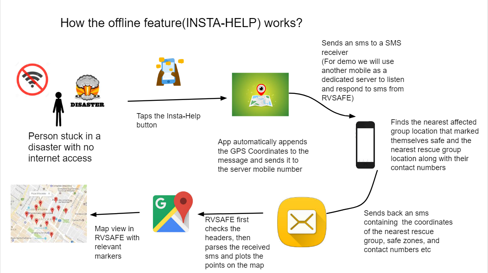
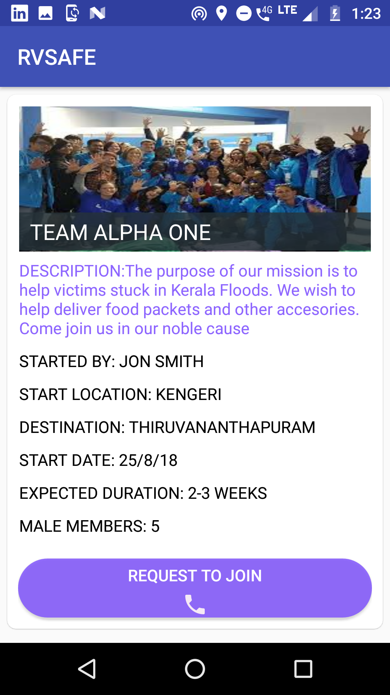
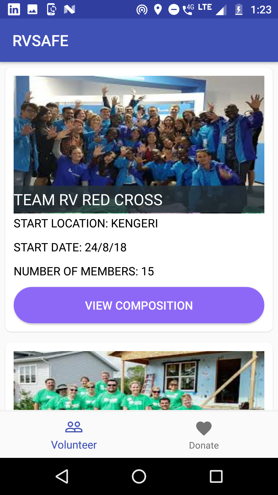
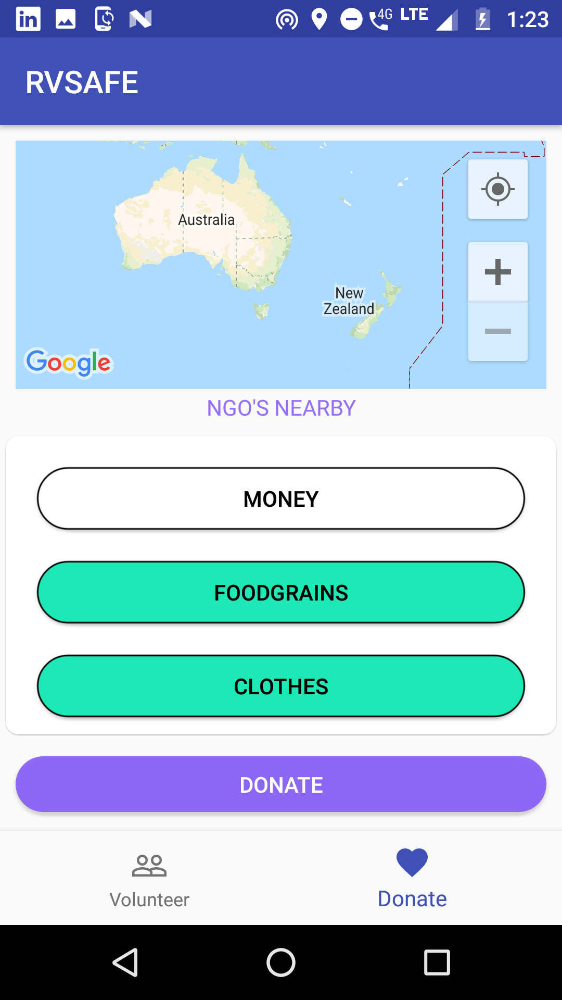

# R V SAFE
## Overview:
Disasters often strike, when we are least prepared to face them. They leave behind a trail of destruction, adversely affecting human life and property. The loss caused by disasters can  be significantly reduced with better communication and proper management. Keeping this in mind we designed R V SAFE, a one stop solution for effectively handling any kind of disasters (Natural/Manmade).

Essentially RVSAFE is an Azure powered Android App that draws inspiration from the problems faced by people during disasters and seeks to solve them in the best possible manner.  We explain each  feature of the app below using the prospective GUI designed by us(work in progress).

## Features Of RV Safe:

RVSAFE opens with a simple user login/registration activity that assigns each user a unique id and lets him choose a password. We use the one time authentication feature so as to skip the arduous task of entering a password each time. The user is then presented with 4 different tabs each serving a important function.
The home tab presents the user with different disaster cards, each representing  an active disaster. The app admins can easily start a new card for any disaster simply by entering a few lines of information in our admin service that is backed by Azure Cosmos DB. The user at this point can either indicate if he/she  is stuck in the disaster or if he/she wants to help out by choosing any one of the options.

#### Choice STUCK IN THIS DISASTER:

    

The stuck in this disaster view first presents to an option to the user to mark his location safe/unsafe. This information is particularly helpful as it can allow everyone trapped in the disaster, to better understand the situation in their surroundings. If a person stuck in the disaster marks himself safe then his location is displayed to victims in his/her vicinity through the map so as to allow  them to relocate themselves to the safe zones. This kind of agglomeration of people at safe zones can also  help optimize the rescue operations as it is easier to rescue people  in groups rather than rescuing people scattered around different locations. The map provides every user with four categories of  coordinates (each indicated with a different color marker) which are 
+ His/her location
+ The location of the nearest safe zones
+ The location of the nearest rescue groups
+ The location of the nearest relief camps 
+ In order to implement this functionality we use the Mongo DB API of Azure Cosmos DB.

We also display the contact numbers of the POC(point of contact)/leader  of the nearest safe zone, and the nearest rescue groups.
Apart from this we have 2 other interesting features.
+Upload an image of people stuck in the disaster

The user is allowed to upload an image of the people trapped along with him. We use Face API provided by Azure Cognitive Services to detect the gender and the age of the people trapped. We count the number of elderly, children, women and men trapped and assign different priorities to the groups. These images along with priority tags are shared with the rescue groups. This can be very beneficial to the rescue groups as it can help them prioritize their rescue operations accordingly and also choose their mode of rescue accordingly (example airlift etc).

+Upload 3 images of the landmarks nearby.
Very often in disasters such as floods the topology of the place changes. Hence it becomes very difficult for rescuers to easily spot the locations in which people are trapped. In such situations having images of nearby landmarks can help rescuers easily approximate your location. Hence the victim can upload any 3 (arbitrarily chosen) images of his surroundings so as to help rescuers spot his location easily.

Another feature we are working on currently(not displayed in the screenshots) is the ability for a user to indicate his requirements (food,fresh water,medicine,bedding etc) through the app so that the same can be air-dropped at his location or carried by rescuers.

All these features as you can see require internet connection. But what if the user has no internet connection?
To accommodate this possibility and provide offline feasibility we designed a novel architecture for RVSAFE called insta-help. Due to the unavailability of messaging API’s  like Twilio we decided to use our own architecture for the time being, by using a dedicated mobile number  to relay information. The working of insta-help is as follows.

With Insta-Help incorporated RVSAFE becomes feasible both online as well as offline. The (Insta-Help feature is complete and will be integrated into the app in the next few days)

##### Want To help Out
This feature is made for those who wish to extend their help to people trapped in the disaster directly or indirectly. The user in this case is presented with 2 tabs
+ Volunteer
+ Donate

Volunteer groups play very important and diverse roles in disaster management from the distribution of food packets and administering first aid to victims, to participating in actual rescue operations   
This tab presents the user with an option to either join an existing volunteer group or start his/her own volunteer group. If a user wishes to start your his/her own volunteer group then he/she is required  to fill out a simple registration form after which the user shall receive a confirmation call from app admins and a card will be created for his/her group.A user can also choose to join an existing volunteer group by using the request to join option after which the group founder will receive your name and contact details and can choose to accept/decline the request. The user can choose to volunteer in at max group. 

### Donate Tab

The other way for people to help out indirectly is through RVSAFE’s donate option.In the donate option the user is presented with a map that shows the location of the office of all NGO’s registered with our app and currently engaged in helping out in the disaster. Clicking on any marker on this map displays the name and contact number the NGO. The user can either personally choose to donate items by reaching out to them at their registered office or can select categories of items that they seek to donate and hit the donate button. The nearest NGO will be notified about their donation and will make a call to pick up the items from the user’s home . 

We have managed to design a simple web portal for NGO’s to facilitate this process. The integration with our database is however pending and will be completed soon.

  
Coming back to the starting view  we have 3 other tabs

### Tab 2: SOS

In order to make RVSAFE a constant security companion we have included  the SOS facility as well. The SOS facility allows users to immediately alert emergency services with just a single tap. Apart from that users  also have an option to send their location in the form of a google maps link via sms to any  3 contacts they choose. 

### Tab 3: Am I Safe
This feature provides weather forecast of your city from registered sources. It gives you a week of predicted  weather data backed with relevant indicators of the level of criticality.

The weather data includes the temperature variations during the past week, the maximum and minimum temperature recorded, level of rainfall etc

Apart from this we also provide live data of the conditions of the dams near your locality. We monitor their conditions continuously and raise alerts when the water levels in them reaches dangerously high levels.  This feature acts as an intelligent watchdog and faithfully informing the users of any threats. The work on this feature is still under progress.

### Tab 4 tips
This tab basically educates the users on best practices to be followed if  a disaster strikes. This can help keep the users better informed on how to effectively handle disasters.

Overall RVSAFE is a complete app that makes a relatively complex task of effectively handling  disasters look easy. We are passionate to get it in active use soon.

